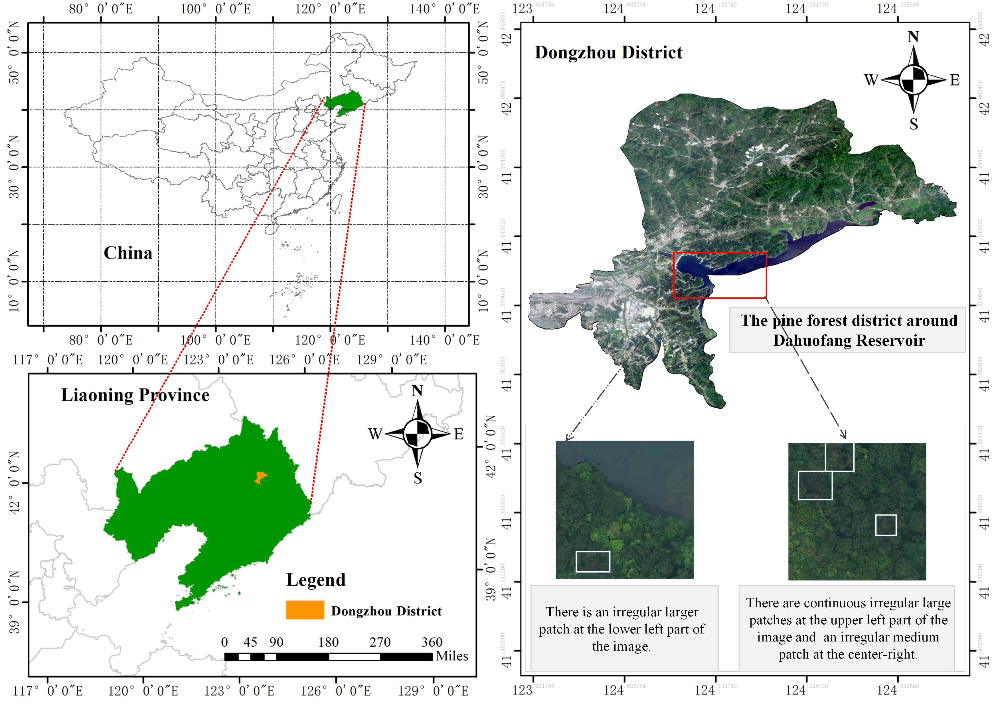

# Accurate segmentation of pine wilt disease in UAV remote sensing imagery: From dataset construction to vision-language segmentation framework with coarse-fine labels

## :evergreen_tree: Overview

- **Research Background**：Pine wilt disease (PWD) is a major forest pest in Jilin Province, posing a severe threat to the pine forest ecosystems.  Traditional ground surveys are inefficient and limited in coverage, urgently requiring remote sensing technologies for large-scale dynamic monitoring.
- **Technical route**：To the best of our knowledge, this study marks the first effort to integrate semantic, textural, and structural information from UAV-based visible remote sensing imagery with tailored textual semantic descriptions customized to the pathological characteristics of pine wilt disease—for monitoring pine wilt disease.  Through cross-modal collaborative semantic modeling, the approach enables precise monitoring of pine wilt disease in small-scale, high-interference scenarios for the first time.
- **Core innovation**：
  - Task-specific dataset with aligned cross-modal annotations
  - Coarse-fine dual-granularity labeling framework for imbalanced small targets
  - Text-driven semantically coupled segmentation network (CF-SCSNet)
 
## :card_file_box:Datasets
<div align="center">
    
</div>
  
## :bar_chart: Model test dataset
| **Dataset**         | Dataset download |
| :------------------ | :--------------------- |
| **self-built PWD** |  |
| **Public generalization(FramSeg-M)** | [dataset](https://www.selectdataset.com/dataset/b6bd538e3e21259cf6958130ef5ed70a)   |
| **Public generalization(FramSeg-L)** | [dataset](https://www.selectdataset.com/dataset/b6bd538e3e21259cf6958130ef5ed70a)   |
| **Public generalization(RRSIS-M)** | [dataset](https://www.selectdataset.com/dataset/5bbd39a0d71020dd530930d9bb39eae7)   |
| **Public generalization(RRSIS-L)** | [dataset](https://www.selectdataset.com/dataset/5bbd39a0d71020dd530930d9bb39eae7)   |

## :fallen_leaf: Visualization
<details open>
  <summary>self-built PWD</summary>
  <div align="center">
    
  </div>
</details>

## :computer: Installation
<details open>
  <summary>Dependency installation steps</summary>
  
  1. **Clone this project and create a conda environment:**
     ```bash
     git clone https://github.com/TechJots-Liu/CF-SCSNet.git
     cd CF-SCSNet
     
     conda create -n cf_scsnet python=3.10.9
     conda activate cf_scsnet
  2. **Install pytorch and torchvision matching your CUDA version:**
     ```bash
     pip install torch==1.13.1+cu117 torchvision==0.14.1+cu117 torchaudio==0.13.1 --extra-index-url https://download.pytorch.org/whl/cu117
  3. **Install requirements:**
     ```bash
     pip install -r requirements.txt
  4. **Load the Roberta word encoder locally**
     [Roberta-base](https://huggingface.co/FacebookAI/roberta-base)
