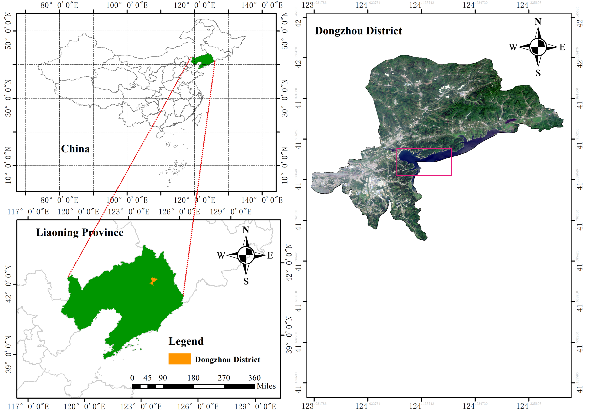

# Accurate segmentation of pine wilt disease in UAV remote sensing imagery: From dataset construction to vision-language segmentation framework with coarse-fine labels

## :evergreen_tree: Overview

- **Research Background**：Pine wilt disease (PWD) is a major forest pest in Jilin Province, posing a severe threat to the pine forest ecosystems.  Traditional ground surveys are inefficient and limited in coverage, urgently requiring remote sensing technologies for large-scale dynamic monitoring.
- **Technical route**：To the best of our knowledge, this study marks the first effort to integrate semantic, textural, and structural information from UAV-based visible remote sensing imagery with tailored textual semantic descriptions customized to the pathological characteristics of pine wilt disease—for monitoring pine wilt disease.  Through cross-modal collaborative semantic modeling, the approach enables precise monitoring of pine wilt disease in small-scale, high-interference scenarios for the first time.
- **Core innovation**：
  - Task-specific dataset with aligned cross-modal annotations
  - Coarse-fine dual-granularity labeling framework for imbalanced small targets
  - Text-driven semantically coupled segmentation network (CF-SCSNet)
 
## :card_file_box:Datasets
<div align="center">
    
</div>
  
## :bar_chart: Model test dataset
| **Dataset**         | Dataset download |
| :------------------ | :--------------------- |
| **self-built PWD** |  |
| **Public generalization(FramSeg-M)** | [dataset](https://www.selectdataset.com/dataset/b6bd538e3e21259cf6958130ef5ed70a)   |
| **Public generalization(FramSeg-L)** | [dataset](https://www.selectdataset.com/dataset/b6bd538e3e21259cf6958130ef5ed70a)   |
| **Public generalization(RRSIS-M)** | [dataset](https://www.selectdataset.com/dataset/5bbd39a0d71020dd530930d9bb39eae7)   |
| **Public generalization(RRSIS-L)** | [dataset](https://www.selectdataset.com/dataset/5bbd39a0d71020dd530930d9bb39eae7)   |

## :fallen_leaf: Visualization
<details open>
  <summary>self-built PWD</summary>
  <div align="center">
    
  </div>
</details>
## :computer: 环境配置
<details open>
  <summary>依赖安装步骤</summary>
  
  1. **克隆仓库并创建环境**
     ```bash
     git clone https://github.com/你的用户名/你的仓库名.git
     cd 你的仓库名
     
     conda create -n pwdm python=3.10
     conda activate pwdm
